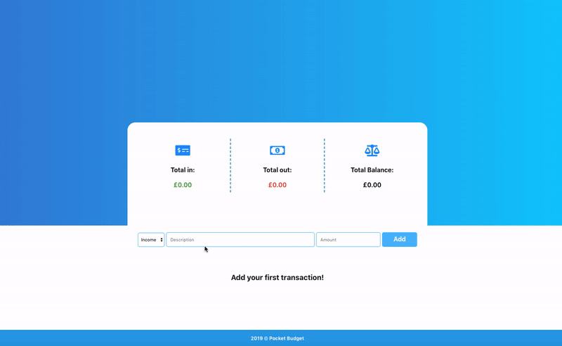

# Pocket Budget

Pocket Budget is an app for managing personal finances. It allows you to enter a new transaction and delete it if needed. These changes are reflected in "Total Balance" menu. Users can also see the percentage of amount spent on the progress bar.  

This app was built in React JS with React Hooks (e.g. React Context) and has local storage. Styled with CSS Grid Layout and Flexbox. App is mobile responsive. 

The deployed version can be seen here:

https://kate-gill.github.io/pocket-budget/

Mini demo gif is shown below:

